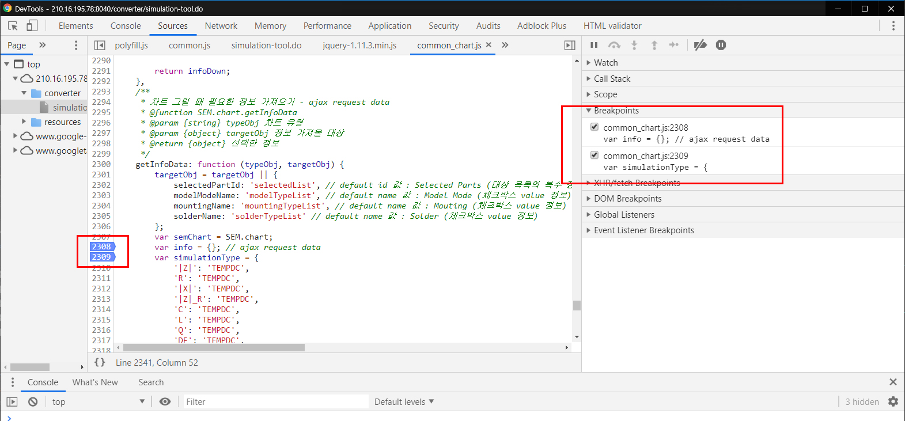
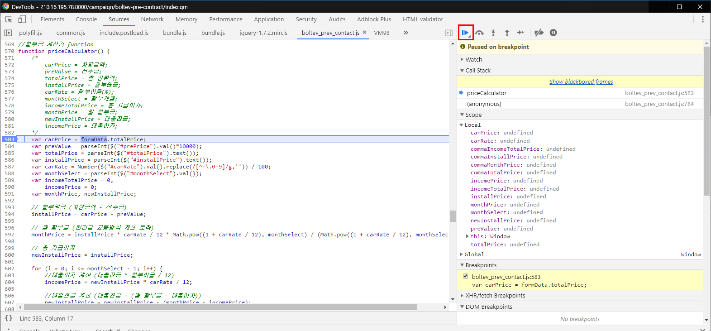
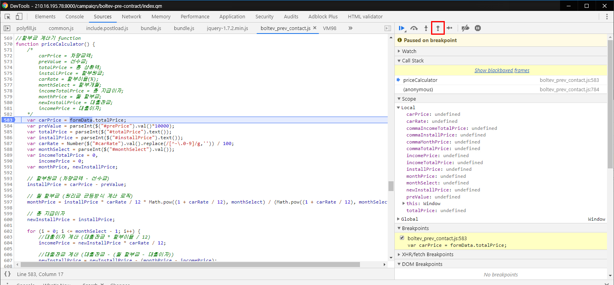
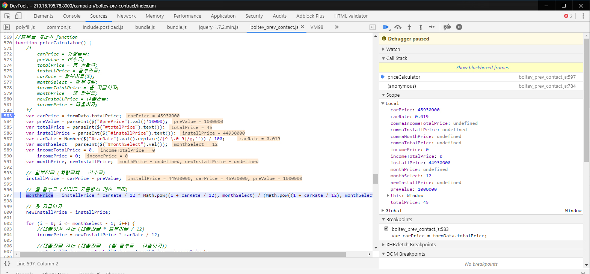

<!-- $theme: gaia -->
<!-- template: invert -->
<!-- page_number: false -->
<!-- $size: 4:3 -->

# `debugging` :computer:
###### by Park Jinhyung
###### jh.park@theuber.co.kr

---

INDEX
<br>

- What is `debugging`?
- How to `debugging`?
- :earth_americas: Chrome Dev Tools
	- `alert();`
	- `console`
	- Network
	- Breakpoints
	- Blackboxing

---

# What is `debugging`?

---

### bug?
<br>

**프로그램 내의 결함이나 문제점**을 이야기하는 것으로
프로그래밍 언어 COBOL의 개발을 주도한
그레이스 호퍼가 1945년 Mark II의 오작동 원인을
찾다가 컴퓨터에 나방이 껴있는 걸 발견한 것

---

### bug?


---

# `debugging === removeBug`
###### 컴퓨터 프로그램의 정확성이나<br>논리적인 오류(버그)를 검출하여 제거하는 과정

---

# How to `debugging`?

---

# :earth_americas: Chrome Dev Tools

---

##### :earth_americas: Chrome Dev Tools
<br>

#### - `alert();`
#### - `console`
#### - Network
#### - Breakpoints
#### - Blackboxing

---

# `alert();`

---

# PASS :yum:

---

# `console`

---

##### :earth_americas: Chrome Dev Tools > `console`
<br>

### `console.log();`

---

##### :earth_americas: Chrome Dev Tools > `console`
<br>

### `console.log();`
### `console.dir();`
### `console.time();`
### `console.group();`
### `console.table();`

---

##### :earth_americas: Chrome Dev Tools > `console`
<br>

### `console.log();` // 로그
### `console.dir();` // 폴더화(객체)
### `console.time();` // 경과시간
### `console.group();` // 그룹지정
### `console.table();` // 데이터 시각화

---

# `console.log();`

---

##### :earth_americas: Chrome Dev Tools > `console` > `console.log()`
<br>

#### `console.log(arr[2]);`
#### `console.log('이름: ' + obj.name);`

```javascript
if (goal === true) {
    console.log('성공');
} else {
    console.log('실패');
}
```

---

# `console.dir();`

---

##### :earth_americas: Chrome Dev Tools > `console` > `console.dir();`
<br>

```javascript
var el = document.getElementById('name');

console.log(el);
console.dir(el);
```

---

##### :earth_americas: Chrome Dev Tools > `console` > `console.dir();`
<br>


---

##### :earth_americas: Chrome Dev Tools > `console` > `console.dir();`
<br>


---

# `console.time();`

---

##### :earth_americas: Chrome Dev Tools > `console` > `console.time();`
<br>

```javascript
console.time('반복문 경과 시간');

var arr = [];
for (var i = 1; i < 1000; i++) {
	for (var j = 1; j < 1000; j++) {
		arr.push(j);
	}
}

console.timeEnd('반복문 경과 시간');
```

---

##### :earth_americas: Chrome Dev Tools > `console` > `console.time();`
<br>


---

# `console.group();`

---

##### :earth_americas: Chrome Dev Tools > `console` > `console.group();`
<br>

```javascript
var _name = ['박진형', '김혜인', '김웅진', '최지영'];
var _location = ['하남', '청주', '인천', '경기'];

console.group('이름');
console.log(_name);
console.groupEnd('이름');

console.group('지역');
console.log(_location);
console.groupEnd('지역');
```

---

##### :earth_americas: Chrome Dev Tools > `console` > `console.group();`
<br>


---

# `console.table();`

---

##### :earth_americas: Chrome Dev Tools > `console` > `console.table();`

```javascript
var data = [
    {
    	"name": "박진형",
        "location": "하남",
        "tel": "4989"
    },
    {
    	"name": "정혜윤",
        "location": "남양주",
        "tel": "4987"
    },
    {
    	"name": "김웅진",
        "location": "일산",
        "tel": "4978"
    }
];
```

---

##### :earth_americas: Chrome Dev Tools > `console` > `console.table();`
<br>


[:chart_with_upwards_trend:](http://210.16.195.78:8040/converter/simulation-tool.do)

---

# Network:hourglass_flowing_sand:

---

##### :earth_americas: Chrome Dev Tools > Network:hourglass_flowing_sand:
<br>


[:chart_with_upwards_trend:](http://210.16.195.78:8040/converter/simulation-tool.do)

---

# Breakpoints:watch:

---

##### :earth_americas: Chrome Dev Tools > Breakpoints:watch:
<br>


---

##### :earth_americas: Chrome Dev Tools > Breakpoints:watch:
<br>


---

##### :earth_americas: Chrome Dev Tools > Breakpoints:watch:
<br>


---

##### :earth_americas: Chrome Dev Tools > Breakpoints:watch:
<br>


---

##### :earth_americas: Chrome Dev Tools > Breakpoints:watch:
<br>

##### Debug Info
- Watch
- Call Stack
- Scope  
- Breakpoints
- Event Listener Breakpoints

---

##### :earth_americas: Chrome Dev Tools > Breakpoints:watch:
<br>


관찰하고 싶은 객체, 변수 등을 등록

---

##### :earth_americas: Chrome Dev Tools > Breakpoints:watch:
<br>


실행중인 정보

---

##### :earth_americas: Chrome Dev Tools > Breakpoints:watch:
<br>


현재 시점의 유효 범위에서 등록된 변수 목록

---

##### :earth_americas: Chrome Dev Tools > Breakpoints:watch:
<br>


지정한 포인트에서 중단

---

##### :earth_americas: Chrome Dev Tools > Breakpoints:watch:
<br>


체크한 event가 발생할 때 중단

---

##### :earth_americas: Chrome Dev Tools > Breakpoints:watch:
<br>


---

##### :earth_americas: Chrome Dev Tools > Breakpoints:watch:
<br>


---

##### :earth_americas: Chrome Dev Tools > Breakpoints:watch:
<br>



다중 선택, 중단점 사용 여부 선택 가능

---

##### :earth_americas: Chrome Dev Tools > Breakpoints:watch:
<br>



중단점을 그만하고 코드 계속 실행(다음 중단점 이동)

---

##### :earth_americas: Chrome Dev Tools > Breakpoints:watch:
<br>


다음 함수 코드로 이동

---

##### :earth_americas: Chrome Dev Tools > Breakpoints:watch:
<br>


함수의 내부 코드로 이동

---

##### :earth_americas: Chrome Dev Tools > Breakpoints:watch:
<br>



현재 함수에서 빠져나와 다음 함수로 이동

---

##### :earth_americas: Chrome Dev Tools > Breakpoints:watch:
<br>


---

##### :earth_americas: Chrome Dev Tools > Breakpoints:watch:
<br>


---

##### :earth_americas: Chrome Dev Tools > Breakpoints:watch:
<br>



---

# Blackboxing:no_entry_sign:

---

##### :earth_americas: Chrome Dev Tools > Blackboxing:no_entry_sign:
<br>


---

##### :earth_americas: Chrome Dev Tools > Blackboxing:no_entry_sign:
<br>


---

##### :earth_americas: Chrome Dev Tools > Testing
<br>

[:car:](http://210.16.195.78:8000/campaign/boltev-pre-contract/index.gm)

[:chart_with_upwards_trend:](http://210.16.195.78:8040/converter/simulation-tool.do)

---

# END :wave:
